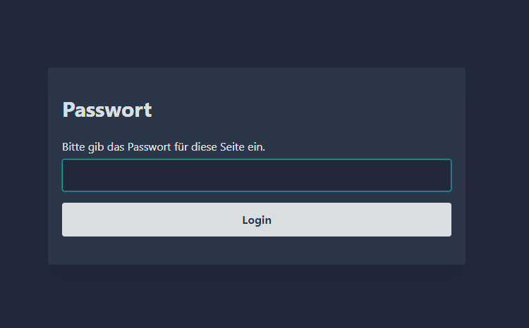
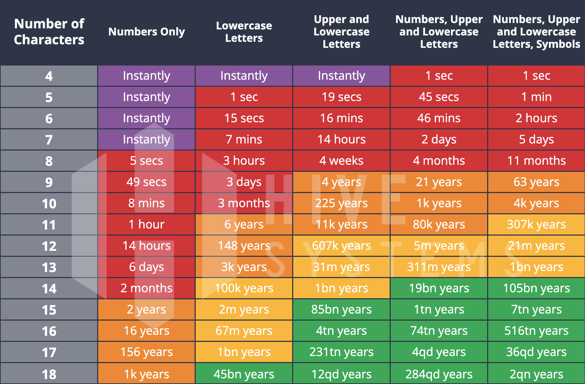

# html-encrypt

A zero config (and only optional minifiers as dependencies) to encrypt html files.
This is a heavy modified clone of [staticrypt](https://github.com/robinmoisson/staticrypt).

<p align="center">
  
      <br>
  <a class="text-center" href="https://html-encrypt-demo.netlify.app">Live Example</a>
<p>


## Installation

```bash
npm i html-encrypt
```

## Execute

```bash
npx html-encrypt <path/index.html>
```

Note: running the command will modify the file.


## Options

- You will be asked to enter the Password

  <p align="center">
    
    <br>
    <a class="text-center" href="https://www.hivesystems.com/blog/examining-the-lastpass-breach-through-our-password-table">Please consider using a safe password</a>
  <p>

- Additionally, you can bring in your own template. Create a .html file and reference it when asked in the CLI.
  ```html
  <form method="post">
      PW: <input type="password" name="" id="">
      <button type="submit">Login</button>
  </form>
  ```


- You can also add --remove-head in order to remove the content of the head for the output file. This might be needed for some SPAs.
  ```bash
  npx html-encrypt --remove-head <path/index.html>
  ```

- You can also add --no-minify in order to not use html-minifier-terser and esbuild.
  ```bash
  npx html-encrypt --no-minify <path/index.html>
  ```
